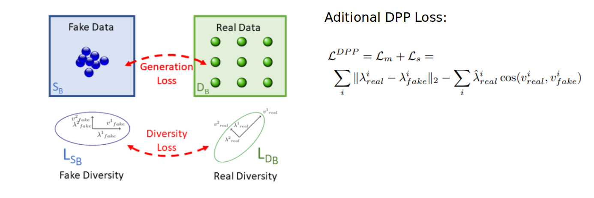
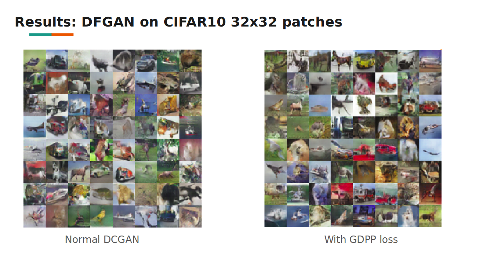

# Fake_Faces_DCGAN_GDPP_LOSS

In this project, I defined and trained a DCGAN model with extra GDPP Loss on a dataset of faces. The goal was to get a generator network to generate new images of faces that look as realistic as possible!
## Dataset
The CelebA dataset contains over 200,000 celebrity images with annotations. Since you're going to be generating faces, you won't need the annotations, you'll only need the images. Note that these are color images with 3 color channels (RGB)#RGB_Images) each. You can download the CelebA dataset by clicking [here](http://mmlab.ie.cuhk.edu.hk/projects/CelebA.html).

## Model
A GAN is comprised of two adversarial networks, a discriminator and a generator.
### Discriminator
* The inputs to the discriminator are 32x32x3 tensor images.
* The output should be a single value that will indicate whether a given image is real or fake.

# Extra Loss: GDPP: Generator  Determinantal Point Processes Loss [here]
(https://arxiv.org/abs/1812.00068).

DPP is an elegant probabilistic measure used to model negative correlations within a subset and hence quantify its diversity. 

Convolutional Layers | Input Dimension | Output Dimension |  Activation Fucntion | Batch Normalization
------ | ----- | ------ |  ------------------- | ------
layer 1 | 3 | 64 | leaky relu | False
layer 2 | 64 | 128 | leaky relu | True
layer 3 | 128 | 256 | leaky relu | True
### Generator
* The inputs to the generator are vectors of some length z_size.
* The output should be a image of shape 32x32x3.

Deconvolutional Layers | Input Dimension | Output Dimension | Activation Function | Batch Normalization
---------------------- | ----- | ------ | ------------------- | ------
Layer 1 | 512 | 256 | relu | True
Layer 2 | 256 | 128 | relu | True
Layer 3 | 128 | 64 | relu | True
Layer 4 | 64 | 3 | relu | False
## Other Parameters
* **Epochs** = 40

* **Optimizer** = Adam
* **Z size** = 100
* **Weight Inititalization**
  * Initialize the weights to a normal distribution, centered around 0, with a standard deviation of 0.02.
  * The bias terms, if they exist, may be left alone or set to 0.
## Results
The dataset is biased; it is made of "celebrity" faces that are mostly white. After training the dataset over 40 epochs, I got the following result.

# Futher Verified on CIFAR 10 datset and compared with normal DCGAN.

